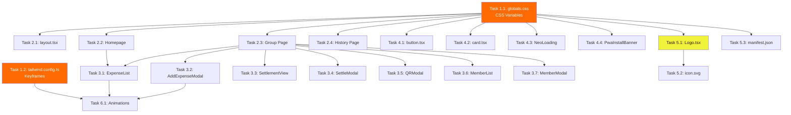

# 🏄 PLAN: Summer Brutal Surf — Giao Diện Mùa Hè Cho Sharetien

> **Phương án A** từ brainstorm session: Kết hợp tinh thần **Swiss Neo-Brutalism** gốc với văn hóa **Surf/Beach Party** rực rỡ mùa hè.

## Overview

### Vấn đề
Giao diện hiện tại của Sharetien sử dụng bảng màu `slate` (xám xanh) lạnh lẽo, phù hợp với phong cách Neo-Brutalism nguyên bản nhưng thiếu sức sống mùa hè. Người dùng (chủ yếu là nhóm bạn trẻ đi du lịch biển, chia tiền ăn nhậu) cần một giao diện truyền tải được năng lượng vui nhộn, sôi động của mùa hè.

### Mục tiêu
Chuyển đổi toàn bộ giao diện Sharetien sang theme **"Summer Brutal Surf"** — giữ nguyên 100% cấu trúc Neo-Brutalism (border dày, hard shadow, uppercase typography, rounded-none) nhưng thay đổi **bảng màu, mascot, hiệu ứng và micro-animations** để mang lại cảm giác bãi biển mùa hè.

### Phạm vi
- **KHÔNG thay đổi** logic nghiệp vụ, API, database, state management
- **CHỈ thay đổi** visual layer: CSS variables, Tailwind classes, SVG mascot, animations, PWA manifest colors
- **QUYẾT ĐỊNH (Đã được User chốt):** Bảng màu Cam/Vàng/Nâu/Teal. Mascot mèo chỉ thêm kính râm retro. Giữ nguyên câu footer "No Debt · Swiss Minimalist Design".

---

## Project Type

**WEB** — Next.js 14 App Router + Tailwind CSS + Shadcn UI

---

## Success Criteria

| # | Tiêu chí | Đo lường |
|---|----------|----------|
| 1 | Bảng màu mới **không có màu tím/violet** | Grep toàn bộ codebase cho hex/hsl purple → 0 kết quả |
| 2 | Tất cả màu `slate` được thay bằng màu summer | Grep `slate-` trong components → 0 kết quả (trừ code không liên quan UI) |
| 3 | Mascot mèo được cập nhật phiên bản mùa hè | Logo SVG mới (thêm kính râm) hiển thị đúng trên mọi kích thước |
| 4 | Hard shadow vẫn hoạt động đúng | Shadow offset `[Xpx_Ypx_0_0_...]` vẫn hiện trên mọi component |
| 5 | `npm run build` thành công không lỗi | Exit code 0 |
| 6 | `npm run lint` pass | Exit code 0 |
| 7 | PWA manifest cập nhật đúng màu theme mới | `theme_color` và `background_color` khớp bảng màu mới |
| 8 | Responsive vẫn hoạt động trên mobile | Kiểm tra trên viewport 375px |
| 9 | Animation mới mượt mà, không giật lag | Chỉ sử dụng `transform` và `opacity` (GPU-accelerated) |
| 10 | `prefers-reduced-motion` được hỗ trợ | Media query có trong globals.css |

---

## Tech Stack

| Công nghệ | Phiên bản | Vai trò |
|-----------|-----------|---------|
| Next.js | 14.2.3 | Framework |
| Tailwind CSS | 3.4.1 | Styling |
| tailwindcss-animate | 1.0.7 | Animations |
| Shadcn UI (CVA + Radix) | Latest | UI primitives |
| Lucide React | 0.364.0 | Icons |
| Google Fonts (Outfit) | - | Typography (giữ nguyên) |

> **Không cần cài thêm dependency mới.** Toàn bộ thay đổi nằm trong CSS variables, Tailwind config, và inline classes.

---

## 🎨 Design System: Summer Brutal Surf

### Bảng Màu Mới

| Token | Hiện tại (Slate) | Mới (Summer) | HSL Value | Hex | Vai trò |
|-------|-------------------|--------------|-----------|-----|---------|
| `--background` | `0 0% 100%` | `45 100% 96%` | Warm Sand | `#FFF8E7` | Nền chính (cát ấm) |
| `--foreground` | `222.2 84% 4.9%` | `20 80% 8%` | Dark Coconut | `#2A1005` | Chữ chính (nâu đậm) |
| `--primary` | `222.2 47.4% 11.2%` | `24 100% 50%` | Sunset Orange | `#FF6B00` | Nút CTA chính |
| `--primary-foreground` | `210 40% 98%` | `45 100% 96%` | Warm Sand | `#FFF8E7` | Chữ trên nút chính |
| `--secondary` | `210 40% 96.1%` | `54 100% 62%` | Acid Lemon | `#F0F33C` | Nền phụ (vàng chanh) |
| `--secondary-foreground` | `222.2 47.4% 11.2%` | `20 80% 8%` | Dark Coconut | `#2A1005` | Chữ trên nền phụ |
| `--accent` | `210 40% 96.1%` | `174 72% 44%` | Ocean Teal | `#20B2AA` | Accent (biển xanh) |
| `--accent-foreground` | `222.2 47.4% 11.2%` | `0 0% 100%` | White | `#FFFFFF` | Chữ trên accent |
| `--destructive` | `0 84.2% 60.2%` | `0 90% 55%` | Hot Coral Red | `#F02D1A` | Lỗi / Số tiền âm |
| `--muted` | `210 40% 96.1%` | `36 60% 90%` | Light Sand | `#F5E6C8` | Nền muted |
| `--muted-foreground` | `215.4 16.3% 46.9%` | `30 30% 45%` | Warm Gray | `#957A5F` | Chữ muted |
| `--border` | `214.3 31.8% 91.4%` | `20 80% 8%` | Dark Coconut | `#2A1005` | Border (nâu đậm) |
| `--card` | `0 0% 100%` | `40 100% 97%` | Cream | `#FFFBF0` | Nền card |
| `--ring` | `222.2 84% 4.9%` | `24 100% 50%` | Sunset Orange | `#FF6B00` | Focus ring |

### Semantic Colors (Dùng trong component)

| Vai trò | Class cũ | Class mới | Lý do |
|---------|----------|-----------|-------|
| Hero/Header background | `bg-slate-900` | `bg-[#2A1005]` (Dark Coconut) | Header tối tạo tương phản với nền cát |
| Hero text | `text-white` | `text-[#FFF8E7]` (Warm Sand) | Ấm hơn trắng thuần |
| Section label | `text-slate-500` | `text-[#957A5F]` (Warm Gray) | Nhãn section phụ |
| Input border | `border-slate-900` | `border-[#2A1005]` | Giữ Neo-Brutalist feel |
| Hard shadow color | `rgba(15,23,42,1)` | `rgba(42,16,5,1)` | Shadow nâu đậm thay vì xám xanh |
| Hard shadow light | `rgba(15,23,42,0.2)` | `rgba(42,16,5,0.2)` | Shadow nhẹ |
| Tab active bg | `bg-slate-900` | `bg-[#FF6B00]` (Sunset Orange) | Tab active nổi bật rực rỡ |
| Expense icon bg | `bg-blue-600` | `bg-[#FF6B00]` | Icon chi tiêu |
| Amount text | `text-blue-600` | `text-[#FF6B00]` | Số tiền nổi bật |
| Settle CTA | `bg-emerald-500` | `bg-[#20B2AA]` (Ocean Teal) | Nút chốt sổ = biển xanh |
| Admin badge | `text-emerald-600` | `text-[#20B2AA]` | Badge quản trị viên |
| Member tag bg | `bg-slate-100` | `bg-[#F0F33C]` (Acid Lemon) | Tag tên thành viên nổi bật |

### Typography
- **Giữ nguyên** font `Outfit` — nó đã rất phù hợp với Neo-Brutalism
- **Giữ nguyên** `font-black`, `uppercase`, `tracking-widest` — DNA của app
- Không thay đổi font-size hay line-height

### Geometry
- **Giữ nguyên** `rounded-none` — 0px border-radius cho Neo-Brutalism
- **Giữ nguyên** `border-2`, `border-4` — border dày đặc trưng
- **Giữ nguyên** hard shadow pattern `shadow-[Xpx_Ypx_0_0_...]` — chỉ đổi màu shadow

---

## File Structure (Các file cần thay đổi)

```text
src/
├── app/
│   ├── globals.css                    ← [MODIFY] CSS variables + summer animations
│   ├── layout.tsx                     ← [MODIFY] themeColor, body classes
│   ├── page.tsx                       ← [MODIFY] Homepage: colors, text, background
│   └── group/
│       └── [id]/
│           ├── page.tsx               ← [MODIFY] Group page: header, tabs, cards
│           └── history/
│               └── page.tsx           ← [MODIFY] History page: colors
├── components/
│   ├── Logo.tsx                       ← [MODIFY] Summer mascot SVG (Thêm kính râm)
│   ├── PwaInstallBanner.tsx           ← [MODIFY] Banner colors
│   ├── expenses/
│   │   ├── ExpenseList.tsx            ← [MODIFY] Card colors, icon colors
│   │   ├── AddExpenseModal.tsx         ← [MODIFY] Modal colors
│   │   ├── SettlementView.tsx         ← [MODIFY] Settlement card colors
│   │   ├── SettleModal.tsx            ← [MODIFY] Modal header color
│   │   └── QRModal.tsx                ← [MODIFY] QR modal colors
│   ├── members/
│   │   ├── MemberList.tsx             ← [MODIFY] Member card colors
│   │   └── MemberModal.tsx            ← [MODIFY] Modal colors
│   └── ui/
│       ├── NeoLoading.tsx             ← [MODIFY] Loading animation colors
│       ├── button.tsx                 ← [MODIFY] Button variants colors
│       └── card.tsx                   ← [MODIFY] Card base styles
├── (không thay đổi: store/, lib/, types/, utils/)
public/
├── manifest.json                      ← [MODIFY] theme_color, background_color
└── icons/
    └── icon.svg                       ← [MODIFY] App icon colors
tailwind.config.ts                     ← [MODIFY] Thêm summer keyframes/animations
```

**Tổng cộng: 17 files cần chỉnh sửa. 0 files mới. 0 files xóa.**

---

## Task Breakdown

### Phase 1: Foundation — Design System (P0)

> **Agent:** `frontend-specialist`
> **Skill:** `tailwind-patterns`, `frontend-design`

---

#### Task 1.1: Cập nhật CSS Variables trong `globals.css`

- **INPUT:** File `src/app/globals.css` hiện tại với bảng màu `slate`
- **OUTPUT:** File `globals.css` với:
  - `:root` chứa bảng màu Summer Brutal Surf (theo bảng Design System ở trên)
  - `.dark` chứa bảng màu tối tương ứng (nâu đậm chủ đạo)
  - Thêm CSS custom properties cho summer-specific colors: `--summer-sand`, `--summer-coconut`, `--summer-orange`, `--summer-lemon`, `--summer-teal`, `--summer-coral`
  - Thêm `@keyframes` cho hiệu ứng sóng biển nhẹ (`wave-sway`) dùng cho decorative elements
  - Thêm `@media (prefers-reduced-motion: reduce)` để tắt animation cho người dùng cần
- **VERIFY:**
  - Mở browser → nền chuyển sang màu cát ấm `#FFF8E7`
  - Chữ chuyển sang màu nâu đậm `#2A1005`
  - Không có màu tím/violet nào trong file

---

#### Task 1.2: Cập nhật `tailwind.config.ts`

- **INPUT:** File `tailwind.config.ts` hiện tại
- **OUTPUT:** Thêm vào `extend`:
  - `keyframes`: `wave-sway` (animation sóng nhẹ), `sun-pulse` (nhịp đập mặt trời cho loading)
  - `animation`: mapping cho các keyframes mới
  - `colors` (tuỳ chọn): thêm `summer` namespace nếu cần override trực tiếp
- **VERIFY:**
  - File không có lỗi TypeScript
  - `npm run build` vẫn pass

---

### Phase 2: Core Layout — Pages (P1)

> **Agent:** `frontend-specialist`
> **Skill:** `nextjs-react-expert`, `clean-code`

---

#### Task 2.1: Cập nhật `layout.tsx`

- **INPUT:** File `src/app/layout.tsx`
- **OUTPUT:**
  - `themeColor` trong viewport config: `#0f172a` → `#2A1005` (Dark Coconut)
  - Body className: thay `bg-slate-50 text-slate-900` → `bg-background text-foreground` (dùng CSS variables)
  - Container border: thay `border-slate-900` → `border-[#2A1005]`
- **VERIFY:**
  - Meta theme-color trong `<head>` là `#2A1005`
  - Body background là màu cát ấm

---

#### Task 2.2: Cập nhật Homepage `page.tsx`

- **INPUT:** File `src/app/page.tsx` (248 dòng)
- **OUTPUT:** Thay đổi tất cả Tailwind classes:
  - Hero header: `bg-slate-900` → `bg-[#2A1005]`, shadow colors
  - Tagline: "No Debt" → "No Debt" (Giữ nguyên)
  - Subtitle: "Tạo nhóm · Thêm chi phí · Chốt sổ" → Giữ nguyên (không thay đổi nội dung chức năng)
  - Input borders: `border-slate-900` → `border-[#2A1005]`
  - Shadow colors: `rgba(15,23,42,...)` → `rgba(42,16,5,...)`
  - Button CTA "Bắt đầu ngay": `bg-slate-900` → `bg-[#FF6B00]`
  - Recent groups card: cập nhật màu tương ứng
  - Footer text color: Giữ nguyên text "No Debt · Swiss Minimalist Design"
  - Selection highlight: `selection:bg-black` → `selection:bg-[#FF6B00]`
- **VERIFY:**
  - Homepage hiển thị màu cam/vàng/nâu, không còn xám xanh
  - Tất cả hover/active states vẫn hoạt động

---

#### Task 2.3: Cập nhật Group Page `group/[id]/page.tsx`

- **INPUT:** File `src/app/group/[id]/page.tsx` (356 dòng)
- **OUTPUT:** Thay đổi Tailwind classes:
  - Header: `border-slate-900` → `border-[#2A1005]`, `bg-white` → `bg-[#FFFBF0]`
  - Logo container: `bg-slate-900` → `bg-[#2A1005]`
  - Group name: `text-slate-900` → `text-foreground`
  - Member tags: `bg-slate-100 border-slate-900` → `bg-[#F0F33C] border-[#2A1005]`
  - Tab bar: active tab `bg-slate-900` → `bg-[#FF6B00]`, shadow colors
  - Share dropdown: border/shadow colors
  - FAB button: `bg-black border-black` → `bg-[#FF6B00] border-[#2A1005]`
  - Loading state: background colors
  - Error state: giữ red nhưng đổi shadow/border sang nâu
- **VERIFY:**
  - Tab active hiển thị màu cam rực
  - FAB button nổi bật màu cam
  - Member tags màu vàng chanh

---

#### Task 2.4: Cập nhật History Page `group/[id]/history/page.tsx`

- **INPUT:** File `src/app/group/[id]/history/page.tsx` (225 dòng)
- **OUTPUT:**
  - Header: thay `bg-white border-slate-900` → `bg-[#FFFBF0] border-[#2A1005]`
  - History icon container: `bg-emerald-100 text-emerald-600` → `bg-[#E0F7FA] text-[#20B2AA]`
  - Shadow colors: `rgba(15,23,42,...)` → `rgba(42,16,5,...)`
  - Period badge: `bg-emerald-400 border-slate-900` → `bg-[#20B2AA] border-[#2A1005]`
  - Record cards: border/shadow summer colors
  - Background: `bg-slate-50` → `bg-background`
- **VERIFY:**
  - History page nhất quán màu sắc với các trang khác

---

### Phase 3: Components — Expenses & Members (P2)

> **Agent:** `frontend-specialist`
> **Skill:** `clean-code`, `frontend-design`

---

#### Task 3.1: Cập nhật `ExpenseList.tsx`

- **INPUT:** File `src/components/expenses/ExpenseList.tsx`
- **OUTPUT:**
  - Receipt icon bg: `bg-blue-600` → `bg-[#FF6B00]`
  - Payer name highlight: `text-blue-600` → `text-[#FF6B00]`
  - Card border/shadow: summer colors
  - Section title border: `border-slate-900` → `border-[#2A1005]`
  - Edit/Delete button borders: summer colors
- **VERIFY:** Expense cards hiển thị với icon cam, shadow nâu

---

#### Task 3.2: Cập nhật `AddExpenseModal.tsx`

- **INPUT:** File `src/components/expenses/AddExpenseModal.tsx`
- **OUTPUT:**
  - Modal overlay: `bg-slate-900/80` → `bg-[#2A1005]/80`
  - Modal border: `border-slate-900` → `border-[#2A1005]`
  - Shadow: summer dark coconut color
  - Header border: `border-slate-900` → `border-[#2A1005]`
  - Amount text: `text-blue-600` → `text-[#FF6B00]`
  - Submit button: `bg-blue-600 hover:bg-blue-500` → `bg-[#FF6B00] hover:bg-[#FF8533]`
  - Input shadow/border: summer colors
- **VERIFY:** Modal mở ra với màu cam/nâu, số tiền hiển thị cam

---

#### Task 3.3: Cập nhật `SettlementView.tsx`

- **INPUT:** File `src/components/expenses/SettlementView.tsx`
- **OUTPUT:**
  - Admin settle box: `bg-emerald-50 border-emerald-600` → `bg-[#E0F7FA] border-[#20B2AA]` (Ocean Teal)
  - Settle button: `bg-emerald-500` → `bg-[#20B2AA]`
  - Summary cards: `bg-slate-100 border-slate-900` → `bg-[#F5E6C8] border-[#2A1005]`
  - Balance avatar: `bg-slate-900` → `bg-[#2A1005]`
  - Transaction from/to: giữ red/green nhưng đổi border sang nâu
  - Arrow container shadow: summer colors
  - QR button: `bg-blue-600` → `bg-[#FF6B00]`
  - "All settled" box: `bg-green-50 border-green-600` → `bg-[#E8F5E9] border-[#20B2AA]`
- **VERIFY:** Settlement view nhất quán với theme mùa hè

---

#### Task 3.4: Cập nhật `SettleModal.tsx`

- **INPUT:** File `src/components/expenses/SettleModal.tsx`
- **OUTPUT:**
  - Modal header: `bg-emerald-400` → `bg-[#20B2AA]`
  - Warning box: `bg-amber-100 border-amber-500` → giữ amber (đã phù hợp mùa hè)
  - Submit button: `bg-emerald-500` → `bg-[#20B2AA]`
  - All border/shadow: summer dark coconut
- **VERIFY:** Settle modal hoạt động đúng với màu mới

---

#### Task 3.5: Cập nhật `QRModal.tsx`

- **INPUT:** File `src/components/expenses/QRModal.tsx`
- **OUTPUT:**
  - Amount text: `text-rose-600` → `text-[#F02D1A]` (Hot Coral Red)
  - QR container border: `border-slate-900` → `border-[#2A1005]`
  - Bank info box: `bg-emerald-50 border-emerald-600` → `bg-[#E0F7FA] border-[#20B2AA]`
  - Name text: `text-emerald-900` → `text-[#006064]`
- **VERIFY:** QR modal hiển thị đúng, QR code vẫn generate OK

---

#### Task 3.6: Cập nhật `MemberList.tsx`

- **INPUT:** File `src/components/members/MemberList.tsx`
- **OUTPUT:**
  - User icon container: `bg-slate-900` → `bg-[#2A1005]`
  - Card border/shadow: summer colors
  - Edit/Delete button borders: summer colors
- **VERIFY:** Member list cards hiển thị đúng

---

#### Task 3.7: Cập nhật `MemberModal.tsx`

- **INPUT:** File `src/components/members/MemberModal.tsx`
- **OUTPUT:**
  - Lưu ý: Modal này vẫn dùng style cũ (rounded-2xl, backdrop-blur). Cần chuyển sang Neo-Brutalism summer style nhất quán
  - Modal container: bỏ `rounded-2xl` → dùng border dày + shadow cứng như AddExpenseModal
  - Colors: summer palette
- **VERIFY:** MemberModal nhất quán style với AddExpenseModal

---

### Phase 4: UI Primitives & Shared Components (P2)

> **Agent:** `frontend-specialist`
> **Skill:** `clean-code`

---

#### Task 4.1: Cập nhật `button.tsx` (CVA variants)

- **INPUT:** File `src/components/ui/button.tsx`
- **OUTPUT:** Cập nhật các variant colors:
  - `default`: `bg-blue-600` → `bg-[#FF6B00]`, shadow colors
  - `destructive`: giữ red nhưng đổi shadow
  - `outline`: border/bg summer tones
  - `secondary`: summer muted tones
  - `ghost`: hover summer tones
  - `link`: `text-blue-400` → `text-[#FF6B00]`
- **VERIFY:** Tất cả variant buttons hiển thị đúng màu mới

---

#### Task 4.2: Cập nhật `card.tsx`

- **INPUT:** File `src/components/ui/card.tsx`
- **OUTPUT:**
  - Default card style: bỏ `rounded-2xl backdrop-blur-2xl` (đã override bằng inline classes ở components)
  - Đổi default border/bg sang summer tokens
- **VERIFY:** Cards base style phù hợp (hầu hết đã override bằng inline)

---

#### Task 4.3: Cập nhật `NeoLoading.tsx`

- **INPUT:** File `src/components/ui/NeoLoading.tsx`
- **OUTPUT:**
  - Border: `border-slate-900` → `border-[#2A1005]`
  - Shadow: summer dark coconut
  - Loading text: `text-slate-900` → `text-foreground`
  - Thêm animation `sun-pulse` thay vì `animate-bounce` cho mùa hè (tuỳ chọn)
- **VERIFY:** Loading screen hiển thị đúng

---

#### Task 4.4: Cập nhật `PwaInstallBanner.tsx`

- **INPUT:** File `src/components/PwaInstallBanner.tsx`
- **OUTPUT:**
  - Banner bg: `bg-slate-900` → `bg-[#2A1005]`
  - Border: `border-white` → `border-[#F0F33C]` (viền vàng chanh nổi bật)
  - Install button: `bg-white text-slate-900` → `bg-[#FF6B00] text-white`
- **VERIFY:** PWA banner nổi bật với màu mùa hè

---

### Phase 5: Mascot & Assets (P2)

> **Agent:** `frontend-specialist`
> **Skill:** `frontend-design`

---

#### Task 5.1: Cập nhật Logo SVG — Mèo Lướt Sóng Mùa Hè

- **INPUT:** File `src/components/Logo.tsx` (SVG inline)
- **OUTPUT:** Cập nhật SVG mascot:
  - Nền: `#1E1E1E` → `#2A1005` (Dark Coconut)
  - Thêm **kính râm retro** trên mắt mèo (2 hình thang/oval đen)
  - Hóa đơn (bill) giữ nguyên dạng zigzag nhưng đổi màu: `#EEEEEE` → `#FFF8E7` (Warm Sand)
  - Các dòng text trên bill: `#AAAAAA` → `#D4A574` (Sandy Brown)
  - Đường nét đứt: `#1E1E1E` → `#FF6B00` (Sunset Orange)
  - Biểu tượng %: nền `#1E1E1E` → `#FF6B00`, chữ `#ffffff` giữ nguyên
  - Bàn chân mèo: giữ trắng, viền `#CCCCCC` → `#D4A574`
- **VERIFY:** Logo hiển thị đúng trên cả kích thước 48px (header) và 96px (loading)

---

#### Task 5.2: Cập nhật `public/icons/icon.svg`

- **INPUT:** File `public/icons/icon.svg`
- **OUTPUT:** Đồng bộ màu sắc với Logo.tsx mới
- **VERIFY:** PWA icon hiển thị đúng khi cài app

---

#### Task 5.3: Cập nhật `public/manifest.json`

- **INPUT:** File `public/manifest.json`
- **OUTPUT:**
  - `theme_color`: `#0f172a` → `#2A1005`
  - `background_color`: `#f8fafc` → `#FFF8E7`
- **VERIFY:** PWA header bar đúng màu khi cài app standalone

---

### Phase 6: Summer Micro-Animations (P3 — Polish)

> **Agent:** `frontend-specialist`
> **Skill:** `frontend-design`

---

#### Task 6.1: Thêm hiệu ứng summer vào `globals.css`

- **INPUT:** `globals.css` (đã update ở Task 1.1)
- **OUTPUT:** Bổ sung:
  - `@keyframes wave-sway`: nhẹ nhàng translate-y 2-3px, cho decorative elements
  - `@keyframes sun-glow`: nhẹ nhàng scale 1→1.05, dùng cho FAB button pulse
  - CSS utility class `.summer-shadow-hover` cho hiệu ứng hover phóng to shadow
  - `@media (prefers-reduced-motion: reduce)` → tắt tất cả custom animations
- **VERIFY:** 
  - Animation chỉ dùng `transform` và `opacity` (GPU-accelerated)
  - Khi bật `prefers-reduced-motion`, animations bị tắt

---

## Dependency Graph



### Execution Order (Tuần tự)

| Thứ tự | Tasks | Lý do |
|--------|-------|-------|
| **1** | 1.1, 1.2 | Foundation: CSS variables + Tailwind config phải xong trước |
| **2** | 2.1 | Layout wrapper phải đúng trước khi chỉnh pages |
| **3** | 4.1, 4.2 | UI primitives phải đúng trước khi dùng trong components |
| **4** | 2.2, 2.3, 2.4 | Pages (có thể song song) |
| **5** | 3.1 → 3.7 | Components (có thể song song, cùng file type) |
| **6** | 4.3, 4.4 | Shared components nhỏ |
| **7** | 5.1, 5.2, 5.3 | Assets & mascot |
| **8** | 6.1 | Polish: Animations (cuối cùng) |

---

## Phase X: Verification (MANDATORY)

### Automated Checks

```bash
# 1. Lint & Type Check
npm run lint && npx tsc --noEmit

# 2. Build Check
npm run build

# 3. Grep for leftover slate colors (should return 0 results in UI files)
# PowerShell:
Select-String -Path "src/**/*.tsx" -Pattern "slate-" -Recurse

# 4. Grep for purple violations
Select-String -Path "src/**/*.tsx","src/**/*.css" -Pattern "(purple|violet|indigo|#[589a-f]{3}[0-9a-f]{3})" -Recurse
```

### Manual Verification

- [ ] Homepage hiển thị bảng màu Summer (cam/vàng/nâu) trên mobile 375px
- [ ] Group page: tabs hoạt động, màu active tab = cam
- [ ] Expense list: cards có shadow nâu, icon cam
- [ ] AddExpense modal: mở/đóng mượt, màu đúng
- [ ] Settlement view: nút QR màu cam, nút chốt sổ màu teal
- [ ] Member list: cards và modal nhất quán
- [ ] History page: màu sắc nhất quán
- [ ] PWA install banner: nổi bật với nền nâu
- [ ] Logo mèo có kính râm, màu sắc mùa hè
- [ ] Loading screen: "MEOW MEOW..." hiển thị đúng
- [ ] Hard shadows hoạt động trên TẤT CẢ components
- [ ] Hover/Active/Focus states tất cả đều phản hồi
- [ ] `npm run build` → success

### Rule Compliance

- [ ] No purple/violet hex codes (Purple Ban ✅)
- [ ] No standard template layouts (giữ nguyên Neo-Brutalism ✅)
- [ ] Socratic Gate was respected (Brainstorm → Plan → Approval ✅)
- [ ] No Bento Grid, No Glassmorphism, No Mesh Gradient (Anti-Safe Harbor ✅)
