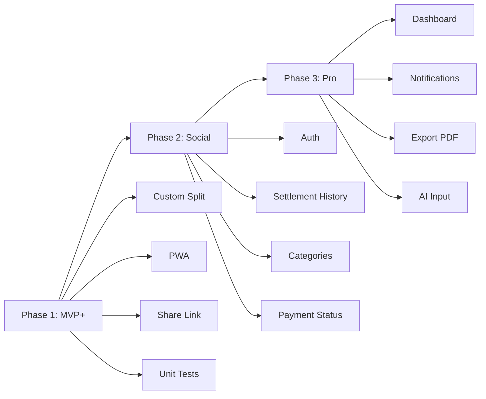

# 📊 Phân Tích & Gợi Ý Nâng Cấp Project Sharetien

## Tổng Quan Hiện Tại

**Sharetien** là ứng dụng chia tiền trọ (Expense Splitter) mobile-first, sử dụng:

| Thành phần | Công nghệ |
|---|---|
| Framework | Next.js 14 (App Router) |
| Database | Supabase (PostgreSQL) |
| State | Zustand |
| Styling | Tailwind CSS + Shadcn UI |
| UI Design | Swiss Brutalist / Neo-Brutalism |

### Tính năng đã có ✅

- Tạo nhóm & join nhóm bằng ID
- CRUD thành viên (tên, thông tin ngân hàng)
- CRUD khoản chi (tên, số tiền, người trả)
- Thuật toán Greedy cấn trừ nợ tối giản
- Chốt sổ: hiển thị ai trả cho ai bao nhiêu
- QR Code chuyển khoản qua VietQR.io
- Lưu nhóm gần đây (localStorage)

---

## 🔥 GỢI Ý TÍNH NĂNG MỚI

### Tier 1: Cần làm ngay (High Impact, Low Effort)

#### 1. 🔗 Chia sẻ nhóm bằng Link thay vì ID
- Hiện tại phải copy UUID dài → khó dùng
- **Gợi ý:** Tạo short link hoặc share dialog (Web Share API) để gửi link `sharetien.app/group/xxx` qua Zalo/Messenger
- Thêm nút **"Chia sẻ nhóm"** ngay trên header

#### 2. 📱 PWA (Progressive Web App)
- Thêm `manifest.json` + Service Worker
- Cho phép **cài app lên màn hình chính** trên điện thoại
- Hỗ trợ **offline cơ bản** (đọc dữ liệu đã cache)

#### 3. 💰 Chia không đều (Custom Split)
- Hiện tại chỉ chia đều cho **tất cả** thành viên
- **Gợi ý:** Cho phép chọn ai tham gia khoản chi (ví dụ: chỉ A và B ăn phở, C không ăn)
- Thêm option chia theo tỉ lệ % hoặc số tiền cụ thể

#### 4. 📊 Dashboard Tổng Quan
- Biểu đồ tròn (Pie chart): ai chi nhiều nhất
- Biểu đồ cột: chi tiêu theo ngày/tuần
- Tổng kết: "Tháng này nhóm chi tổng cộng X đồng"

---

### Tier 2: Nên có (Medium Impact)

#### 5. 🗂️ Phân loại chi tiêu (Category)
- Tags: Tiền trọ, Ăn uống, Điện nước, Giải trí, Khác
- Biểu đồ chi tiêu theo danh mục
- Filter/search khoản chi

#### 6. 📅 Chốt sổ theo kỳ (Monthly Settlement)
- Mỗi tháng tạo 1 kỳ chốt sổ
- Lưu lại lịch sử các kỳ trước
- Bắt đầu kỳ mới từ số dư = 0

#### 7. ✅ Đánh dấu "Đã chuyển khoản"
- Sau khi chốt sổ, người dùng tick "Đã thanh toán" cho từng giao dịch
- Hiển thị trạng thái: ⏳ Đang chờ / ✅ Đã chuyển
- Ghi nhận timestamp khi thanh toán

#### 8. 🔔 Thông báo / Nhắc nhở
- Nhắc nhở trả tiền qua email hoặc push notification
- Thông báo khi có khoản chi mới trong nhóm

#### 9. 🔐 Authentication (Xác thực người dùng)
- Hiện tại ai cũng access được mọi nhóm nếu biết ID
- Thêm **Supabase Auth**: đăng nhập Google/GitHub/Email
- Mỗi người chỉ thấy nhóm mình tham gia
- RLS policies bảo mật theo user

---

### Tier 3: Nâng cao (Low Priority, High Impact)

#### 10. 💬 Ghi chú & Hình ảnh đính kèm
- Upload hóa đơn/bill (Supabase Storage)
- Ghi chú cho khoản chi

#### 11. 🌐 Đa ngôn ngữ (i18n)
- Hỗ trợ tiếng Anh cho bạn bè quốc tế
- Tự detect ngôn ngữ trình duyệt

#### 12. 📤 Export báo cáo
- Xuất file PDF/Excel tổng kết chi tiêu tháng
- Gửi email báo cáo

#### 13. 🤖 Nhập chi tiêu bằng AI
- Nhập text tự nhiên: "A mua gạo 35k" → tự parse thành expense
- OCR bill/hóa đơn tự động

---

## 🛠️ GỢI Ý NÂNG CẤP KỸ THUẬT

### Code Quality

| Vấn đề | Gợi ý |
|---|---|
| Không có test nào | Thêm **unit test** cho `calculator.ts` (Jest/Vitest) + **E2E test** (Playwright) |
| `console.log` debug trong production | Dùng logger có level (dev/prod) hoặc xóa trước deploy |
| Không có error boundary | Thêm React Error Boundary cho UX tốt hơn |
| `any` type trong store mappers | Định nghĩa Supabase DB types chính xác |

### Database & Backend

| Vấn đề | Gợi ý |
|---|---|
| Thiếu bảng `expense_splits` | Schema có interface `ExpenseSplit` nhưng chưa dùng → cần thêm nếu muốn chia không đều |
| RLS policy mở hoàn toàn | Thêm Auth + policy theo user cho production |
| Không có index | Thêm index cho `group_id` trên `members` và `expenses` |
| Không có soft delete | Thêm `deleted_at` column thay vì xóa cứng |

### Performance & UX

| Vấn đề | Gợi ý |
|---|---|
| Không có loading skeleton | Thêm Skeleton UI khi đang fetch dữ liệu |
| Dùng `alert()` và `confirm()` | Thay bằng custom Toast/Dialog component |
| Không có form validation | Thêm `zod` + `react-hook-form` cho validation chặt chẽ |
| Không có SEO metadata | Thêm `metadata` export cho Next.js |
| Design `MemberModal` và `QRModal` không đồng nhất | Thống nhất theo neo-brutalism style như các component khác |

### DevOps

| Vấn đề | Gợi ý |
|---|---|
| `.env.local` không có trong `.gitignore` sample | Kiểm tra lại security |
| Không có CI/CD | Thêm GitHub Actions: lint, build, test |
| Không có Dockerfile | Container hóa cho deploy dễ dàng |

---

## 🗺️ Roadmap Gợi Ý

